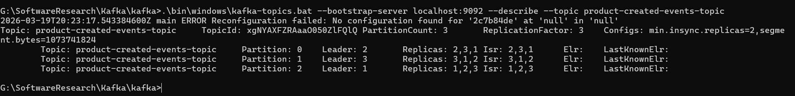
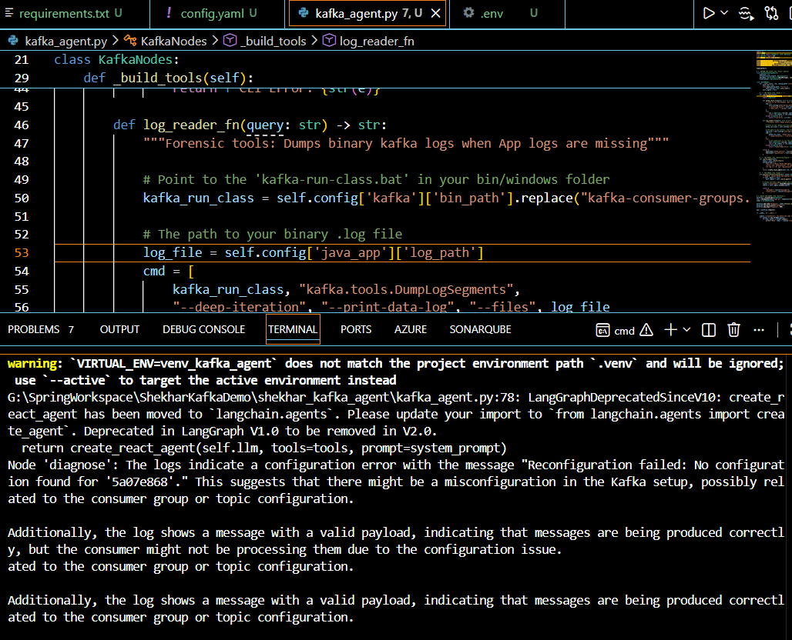
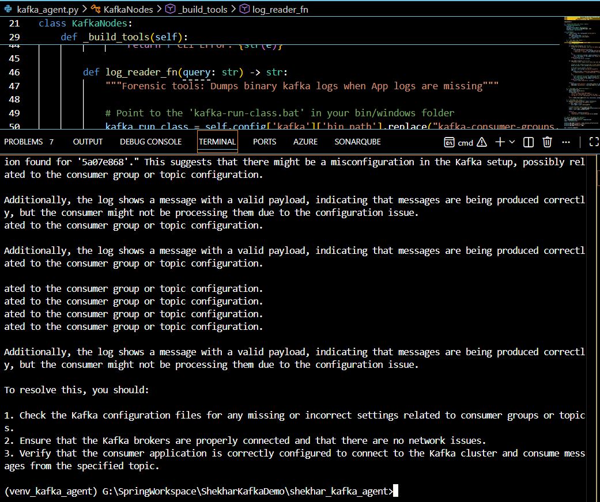
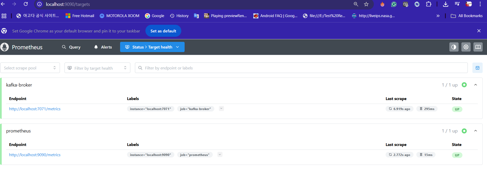
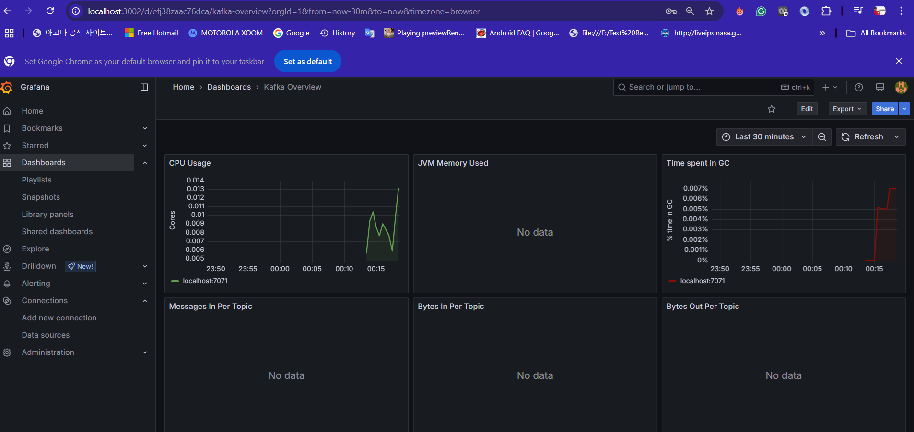
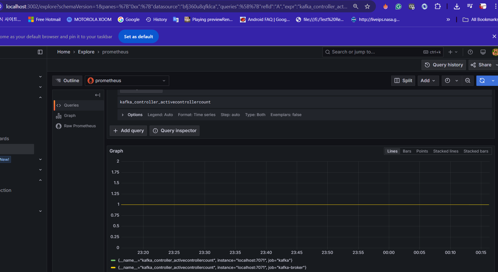
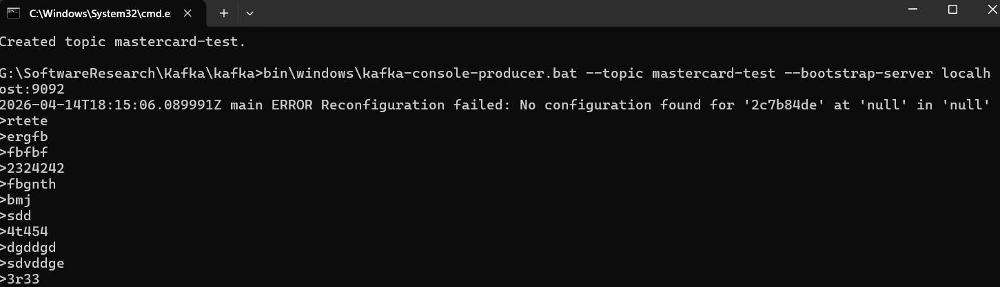
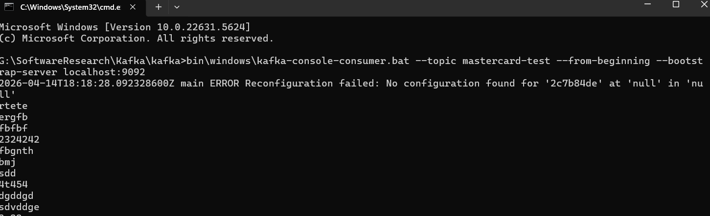

📊 **Infrastructure Verification**
The following screenshot confirms the successful creation of a
3-partition, 3-replica topic
with distributed Leaders across all three brokers (1, 2, and 3).
🛠️ Implementation Details (Spring Boot 3.x)

1. **Reliable Producer & Metadata Tracing**
   I implemented a Traceable Producer that injects a correlationId into the Kafka Record Headers. This allows for end-to-end distributed tracing without polluting the JSON payload.

   Key-Based Partitioning: Guarantees that all events for a specific product land in the same partition.

   Idempotent Producer: enable.idempotence=true to prevent duplicate messages during network retries.

2. **Resilient Consumer & Idempotency Guard**
   The Consumer is designed with a "Defensive Perimeter" to handle the "At-Least-Once" delivery challenges of Kafka:

   Manual Offset Management: Uses AckMode.MANUAL_IMMEDIATE to ensure the offset is only committed after successful DB persistence.

   Idempotency Check: Uses an H2 Persistent Database (G: drive) to verify if a productId already exists before processing, preventing data corruption.

   Isolation Level: read_committed to ensure the consumer never reads "dirty" data from failed producer transactions.

**Edge Case Testing**: This Spring Boot implementation has been thoroughly tested against multiple edge cases including broker failover, poison pill messages, offset resets, and consumer lag scenarios.

🤖 ** AI-Driven Operations (AIOps): The LangGraph Agent [PILOT MODE]**
To solve the "Silent Failure" problem, I developed a Stateful AI Agent using LangChain and LangGraph. This is a **PILOT MODE** implementation that performs Autonomous Root Cause Analysis (RCA) by actively reading Kafka logs and providing intelligent recommendations.

**Kafka Broker Screenshot:**

⚡ **Evidence of Agent Log Analysis & Recommendations:**
The following agent implementations serve as proof points that the agent is reading Kafka logs and providing suggestions for corrective action:

**kafka_agent**: Core infrastructure audit engine that reads kafka-consumer-groups logs

**kafka_agent2**: Advanced binary forensics engine that analyzes Kafka segment logs

**Agentic Capabilities**:
Infrastructure Audit: The agent calls a custom tool to run kafka-consumer-groups and diagnose Lag from log outputs.
Binary Forensics: If application logs are missing, the agent uses the DumpLogSegments utility to inspect Binary Kafka Segments on the G: drive to extract payloads and headers.
Reasoning Loop: Uses GPT-4o to correlate infrastructure lag with application errors and suggests corrective actions.

**Log-Driven Recommendations**: The agent actively monitors logs (docs/kafka_agent and docs/kafka_agent2 implementations) to detect anomalies and recommend actions.

📊 **Agent Output Evidence**
Below is the execution trace of the Kafka Architect Agent identifying a metadata mismatch and auditing the binary log:
Scenario 1: Autonomous Lag Diagnosis
Scenario 2: Binary Payload Extraction & Analysis

🧪 **Resilience & Chaos Testing**
Broker Failover: Terminated the Leader Broker for Partition 0; observed an automatic Leader Election via the KRaft Quorum.
Poison Pill Handling: Implemented a Dead Letter Topic (DLT) pattern using @RetryableTopic. Verified that malformed JSONs are moved to a "Hospital" topic rather than blocking the main pipeline.
Offset Time-Travel: Performed a surgical Offset Reset to earliest to demonstrate the ability to re-process historical data after a consumer fix.

� **Implementation Steps: Kafka Observability Stack**

**1. Infrastructure Foundation (G: Drive Setup)**
Organized a dedicated monitoring workspace on a secondary drive (G:\Monitoring) to ensure a zero-impact installation on the host operating system.
Deployed Portable Standalone Binaries for Prometheus (LTS 3.5.2) and Grafana (v11.5) to maintain a lean, registry-free environment.

**2. Metric Extraction (JMX Exporter)**
Integrated the JMX Prometheus Java Agent (jmx_prometheus_javaagent-1.5.0.jar) into the Kafka Broker process.
Configured KAFKA_OPTS in the startup batch files to expose internal MBeans (Metrics) on port 7071.
Authored a custom kafka_config.yml to map raw JMX MBeans (like ActiveControllerCount and BytesInPerSec) into Prometheus-compatible formats.

**3. Data Collection (Prometheus Scrape Configuration)**
Configured Prometheus as a Time-Series Database (TSDB) to "scrape" the Kafka JMX endpoint every 15 seconds.
Aligned the job_name to kafka within prometheus.yml to ensure seamless compatibility with standard visualization templates.
Verified data ingestion via the Prometheus Targets dashboard (Status: UP).

**4. Visualization & Analysis (Grafana)**
Provisioned a Grafana Server on port 3005 (customized to avoid local port conflicts).
Established a secure data connection between Grafana and the local Prometheus instance (http://localhost:9090).
Imported a specialized Kafka Dashboard (ID: 721) and performed Label Alignment to visualize real-time spikes in CPU, Memory, and Throughput.

**5. Validation & Smoke Testing**
Triggered real-time traffic using the Kafka Console Producer and Consumer CLI tools.
Validated the KRaft Quorum health by monitoring the ActiveControllerCount metric (Value: 1), confirming a stable, leader-elected cluster.

�🚀 **How to Run Locally**
Format Storage: kafka-storage.bat format -t <UUID> -c broker1.properties (Repeat for all 3).
Start Cluster: Launch 3 separate CMD windows for each broker config.
Start Services: Run the Producer (Port 8080) and Consumer (Port 8081).
Run AI Agent (PILOT MODE):

- docs/kafka_agent.py - Core infrastructure audit: uv run python docs/kafka_agent.py
- docs/kafka_agent2.py - Binary forensics analysis: uv run python docs/kafka_agent2.py
  These agents read Kafka logs and provide actionable insights for system health and recovery.
